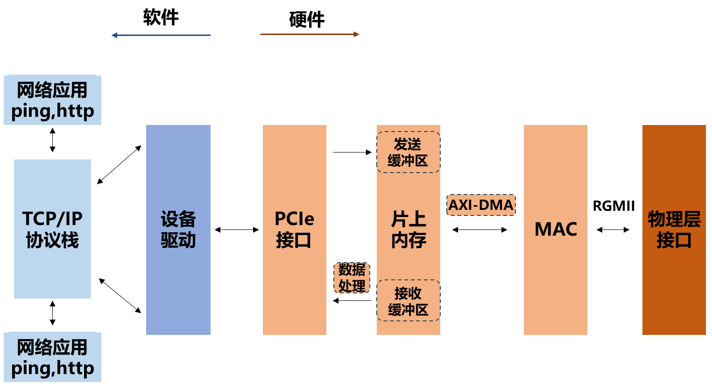
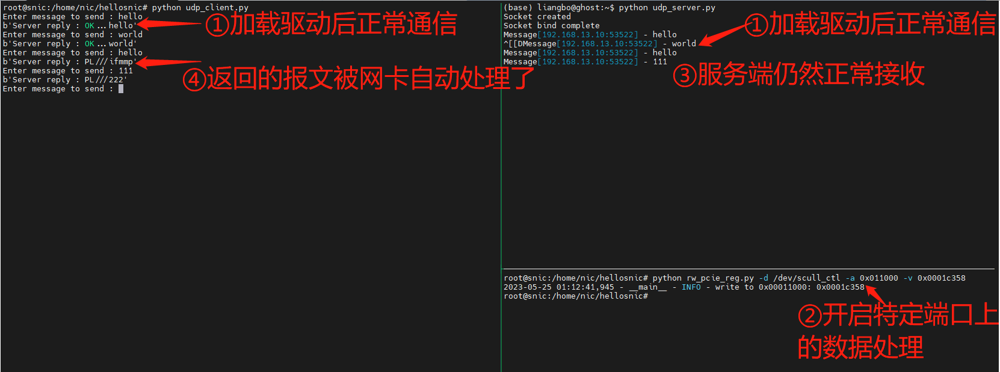
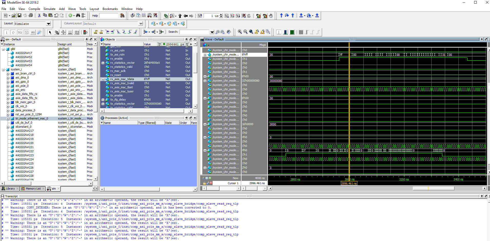

## Hellosnic
智能网卡的结构完整的入门级示例，可以：

* 借助cocotb进行仿真，观察报文的接收和发送
* 提供一个简单的数据处理模块，对设定的端口来源的流量进行简单的处理（数据数值+1，无实质用途，仅示例）；也可以自行扩展
* 可以实际运行，在特定的开发板上；加载驱动后可以像一般的网卡一样使用（但没有性能和可靠性保证）

### 架构

尽可能简单：

* 假设是使用千兆以太网电口，与物理层芯片的接口假设是RGMII
* 以太网报文经MAC与物理层交互
* MAC经过一个DMA模块，与网卡上的内存交互
* PCIe直接取放内存内容（无主机级别的DMA）
* 没有中断（而是在驱动上用轮询代替）

在除数据处理外，其他都采用xilinx的IP核实现。具体的架构图见[pdf](arch/system.pdf)

### 运行实例

实际运行环境：

* FPGA：Kintex 7，7k160
* 开发板：某品牌（需要根据实际情况调整约束文件引脚）
* IDE：Vivado 2019.2 windows
* 板卡实际部署环境：ubuntu 16.04， 内核版本：4.4.0-131-generic
* 通过以太网电口连入局域网，预设地址：192.168.13.10/24 

### 仿真环境

可运行的仿真环境：

* cocotb：1.7.0.dev0
* modelsim：2019.2

其他环境理论上也可运行。由于大量使用xilinx的IP核，需要先在仿真软件中编译IP核。

