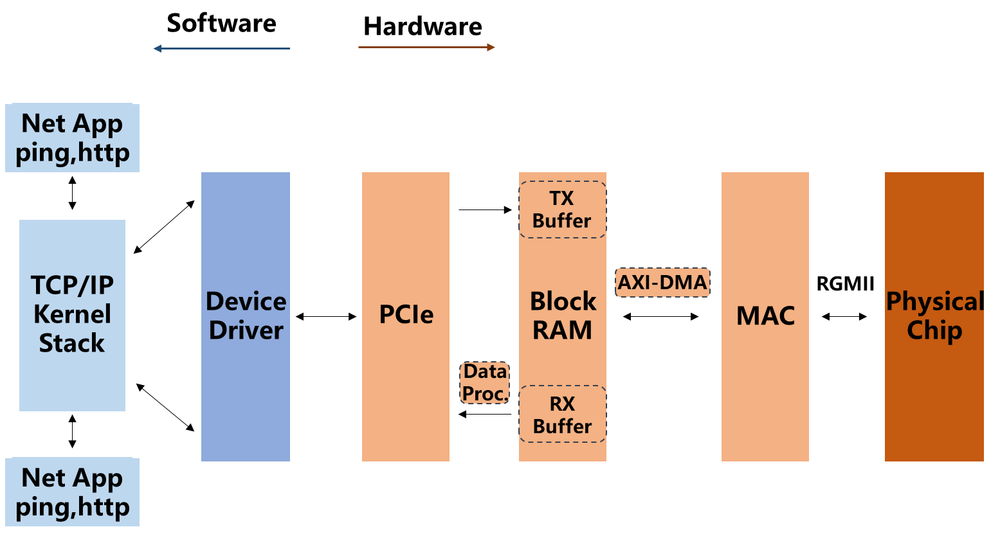
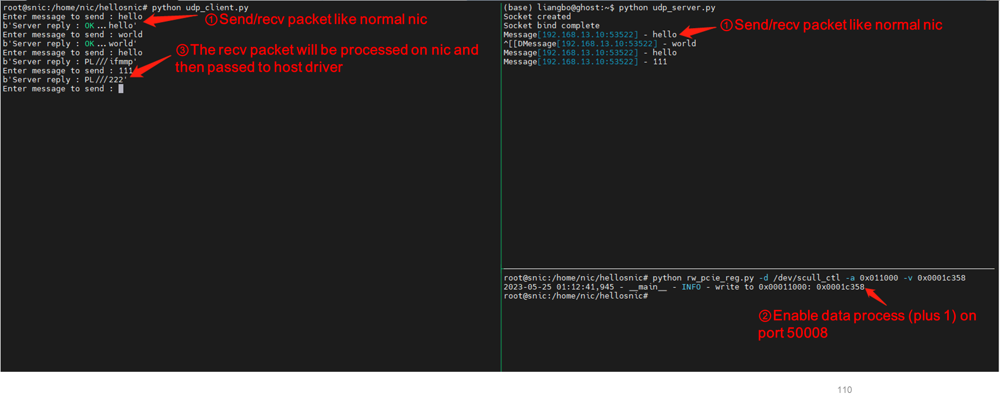

## Hellosnic
An elementary-level smartnic example, with fpga-based integrated structure. 

* Simulation with [Cocotb](https://www.cocotb.org/), facilitates the observation of message reception and transmission
* Provide a simple data processing module to perform some processing on the traffic. Only apply to udp packet with preset port.  It can also be expanded on your own.
* Can be actually run on a specific development board. After loading the driver, it can be used like a regular network card (but there is no guarantee of performance and reliability)

### Architecture

As simple as possible：

* Assuming a gigabit Ethernet port is used and the interface with the physical layer chip is assumed to be RGMII
* Above the physical layer is a MAC module
* Packet from/to the MAC passes through a DMA module and save to/load from the memory on the network card
* PCIe directly fetches and stores memory content (without host level DMA)
* No interruption (instead of using polling on the host driver)

Except data processing, all other implementations are implemented using Xilinx's IP core. The specific architecture diagram is shown in [pdf](arch/system.pdf)

### Running

operating environment:

* FPGA: Kinex 7, 7k160
* Development board: A certain brand (constraint file  need to be adjusted according to the actual situation)
* IDE: Vivado 2019.2, windows 10
* Host of the board(nic) : ubuntu 16.04, kernel version: 4.4.0-131 generic
* Connect to the local area network through the Ethernet port, with a preset address of 192.168.13.10/24

The tarball of project can be found in release assets.

### Simulation

Environment:

* Cocotb: 1.7.0.dev0
* Modelsim: 2019. 2

Due to the use of Xilinx's IP cores, it is necessary to first compile the IP cores in simulation software.

### References

[1] How to Design SmartNICs Using FPGAs to Increase Server Compute Capacity. Achronix, 2019 [[Website]](https://www.achronix.com/sites/default/files/docs/How_to_Design_SmartNICs_Using_FPGAs_to_Increase_Server_Compute_Capacity_WP017.pdf)

[2] Linux Device Driver, 3rd edition. [Website](https://lwn.net/Kernel/LDD3/)

[3] https://github.com/duxing2007/ldd3-examples-3.x
